# 이벤트 기반 마이크로서비스

[Creating event-driven microservices: the why, how and what by Andrew Schofield](https://www.youtube.com/watch?v=ksRCq0BJef8) 발표는
보고 남기 내용입니다. 틀린 내용이 있을 수 있습니다.

### 마이크로서비스란?

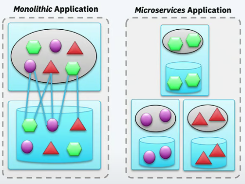

하나의 서비스가 아닌 복수개 서비스로 하나의 어플리케이션을 구현하는 방법이다. 각 서비스는 독립적으며 각자의 목적을 분명하게 가지고 있다.
서비스간 커뮤니케이션은 네트워크를 거쳐일어나며 이는 서로 결합도를 낮춰준다. 각 서비스는 서로 독립적으로 배포할 수 있고 확장할 수 있으며 유지보수, 테스트 가능하다.

보통 마이크로서비스를 구현함에 있어서 서비스마다 REST API를 개발하고 서로 REST API를 호출해 사용자 요청을 처리하려한다. 
이런 구조는 서비스가 많아질수록 latency 가 점점 길어지며 한 서비스가 장애가 생길시 장애가 전체로 퍼질 수 있다.
결국 이 문제를 해결하기 위해선 이벤트 기반으로 비동기 구조로 가야한다. 

### 데이터 중심 vs 이벤트 중심

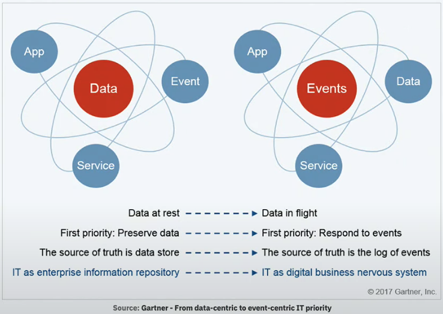

일반적인 비지니스 어플레케이션은 데이터가 중심이다. 모든 것이 데이터베이스 안에 들어있으며 언제나 데이터 정합을 맞추는데 노력한다.
이는 반응성 좋은 어플리케이션 만들기 어렵다. 동기적 통신이어서 저장할 데이터가 많아질 경우 호출해야한 API가 많아지고 사용자에게 응답이 늦게 내려간다.

이벤트 기반 방식은 다르다. 이벤트가 중심이다. 데이터 보다는 이벤트 처리에 더 초점이 맞춰져있다. 비동기 통신이며 빠르게 응답을 내려주려 노력한다.
데이터는 그 뒤에 처리된다. 예를 들면 뱅킹 어플리케이션에서 지불 요청을 한다고 가정하자. (지불 요청을 완전히 처리하는데 시간이 걸린다고 가정한다.)
이벤트 기반 방식에서는 사용자가 요청하면 일단 submit 됐다고 응답을 내려준다. 이후 클라이언트에서 서버로 질의해서 완료됐는지 확인하거나
서버측에서 완료됐다고 알림을 주는 형식이다. 데이터 중심 구조에서는 사용자가 처음 요청을 보내고 완료될 때까지 응답을 기다려야한다.

### 이벤트 기반 마이크로서비스

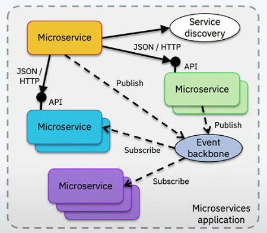

이벤트로 주로 커뮤니케이션한다. 필요한 곳에서만 API 를 통한다. 마이크로서비스는 이벤트를 만들기도 하고 소비하기도 한다.
이벤트는 이벤트 백본(backbone)를 통해 전달된다. 이벤트로 서로 대화하면서 서비스간 결합을 낮추는 식이다. 데이터는 `eventually consistency`로 당장 일관성이
맞지 않더라도 결국에는 일관성을 유지할 수 있도록 한다.

### 메세징 패턴

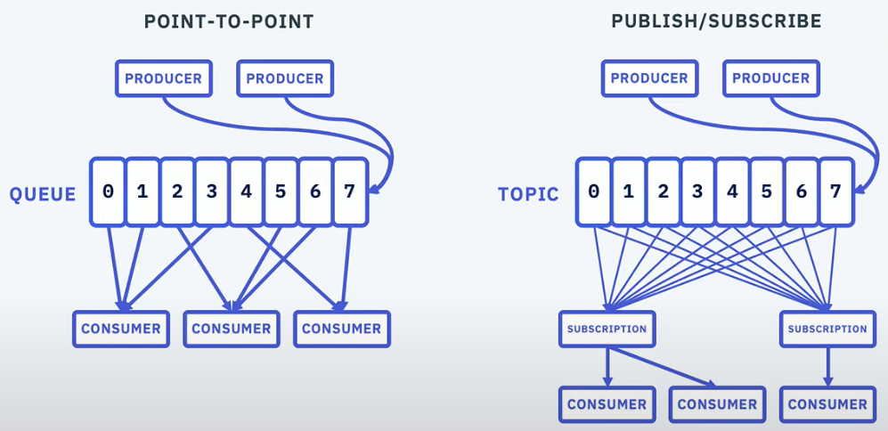

메세징 방식에 두가지가 있다. POINT-TO-POINT 방식과 PUBLISH/SUBSCRIBE 방식이다.
POINT-TO-POINT 는 PRODUCER 에서 메세지를 만들면 특정 CONSUMER 로 전달하는 패턴이다.
메세지가 하나의 CONSUMER 로만 전달되고 다른 CONSUMER 는 받을 수 없다.
PUBLISH/SUBSCRIBE 방식은 PRODUCER 에서 메세지를 만들면 구독중인 여러 CONSUMER 로 전달하는 패턴이다.
데이터를 fan-out 하기 좋은 구조이며 이 구조가 서비스간 결합을 낮추는데 도움을 준다.
필요하면 새로운 CONSUMER 를 구현하면 되지 PRODUCER 쪽을 변경할 필요는 없다.

### 카프카

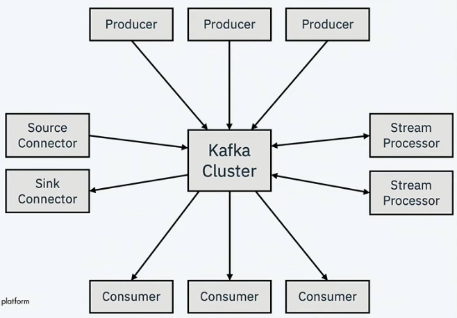

이벤티 기반 마이크로서비스에서 필요한 `메세징 publish/subscribe`을 구현하려면 어떻게 해야할까? 보통 kafka 를 사용한다.
`메세징 publish/subscribe`를 지원할 뿐만 아니라 실시간으로 이벤트 streaming 처리 기능도 제공하며 방대한 데이터를 저장까지 가능하다.
`sink connector`가 있어서 기존 시스템에서 이벤트를 얻고 싶다면 별도 프로그램 작성없이 가능하다.

### Event backbone

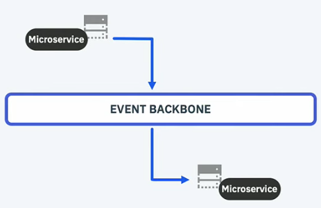

한 마이크로서비스가 발행한 이벤트를 다른 마이크로서비스가 구독하는 모습이다.
위에서 이야기한 결합을 낮추는 장점 뿐만아니라 위 마이크로서비스가 peak 가 있을시 아래 마이크로서비스에는 영향이 없는 장점이 있다.
또한 위 마이크로서비스에 영향 없이 아래 마이크로서비스에 maintenance 까지 걸 수 있다.
잠깐 어플리케이션 내리고 업그레이드하고 다시 재기동하면 된다. 대기중인 이벤트를 처리하면 끝이다.

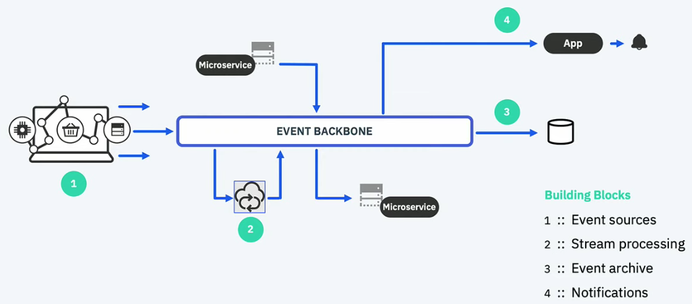

위에서 `sink connector` 언급을 했듯이 Enterprise IT system 이든 DB(DB 데이터 변경이 감지해 이벤트 발행)든 이벤트를 생성하는 역할이 있으며 `Event sources`라 부른다.
다른 block 으로는 하나 토픽을 구독해 처리한 뒤 다른 토픽으로 이벤트를 넣어주는 `Stream processing`이 있다.
이벤트 백본(backbone)은 방대한 이벤트들을 저장할 수 있다 그러나 제한이 없는건 아니다. 영속을 위해 `Event archive`가 있다.
오래된 이벤트를 보고 싶다면 `Event archive`를 참조하면 된다. 마지막으로 사용자로 알림을 보내는 `Notifications`이 있다.

### 간단한 Streaming processing 예제

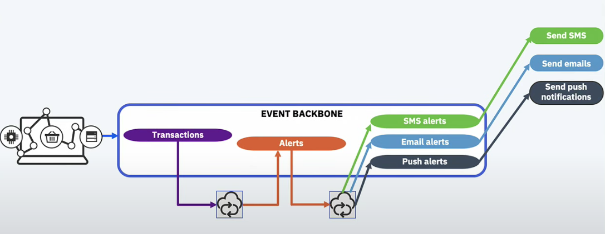

뱅킹 어플리케이션에서 지불 요청이 들어왔다고 가정한다. 지불 이벤트가 이벤트 백본(backbone)에 들어오면 `stream processing`으로 문제가 있는 지불 요청인지 확인한다.
어뷰저가 보낸 요청이라면 `Alerts topic`에 이벤트를 다시 넣어주면 다른 `stream processor` 가 이를 `SNS 혹은 Email, Push`로 사용자에게 알려준다.

### How to get started

이벤트 스토밍 워크샵으로 으로 이벤트, 액터, 데이터, 커맨드를 발견할 수 있다.
(개인적으로 [마이크로서비 개발을 위한 Domain Driven Design](https://www.youtube.com/watch?v=QUMERCN3rZs) 영상이 도움이 됐다.)

### 복잡한 이벤트 처리 예제

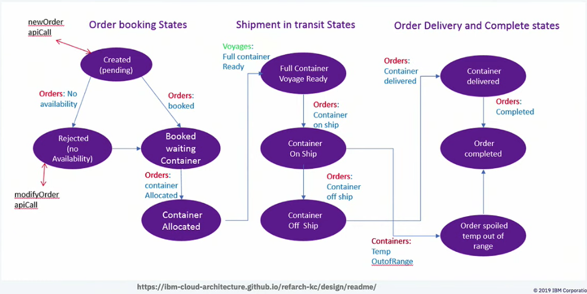

주문이 들어오면 컨테이너를 할당하고 운송하는 과정을 나타낸다. 이를 이벤트로 대화하며 상태를 관리할 수 있다.

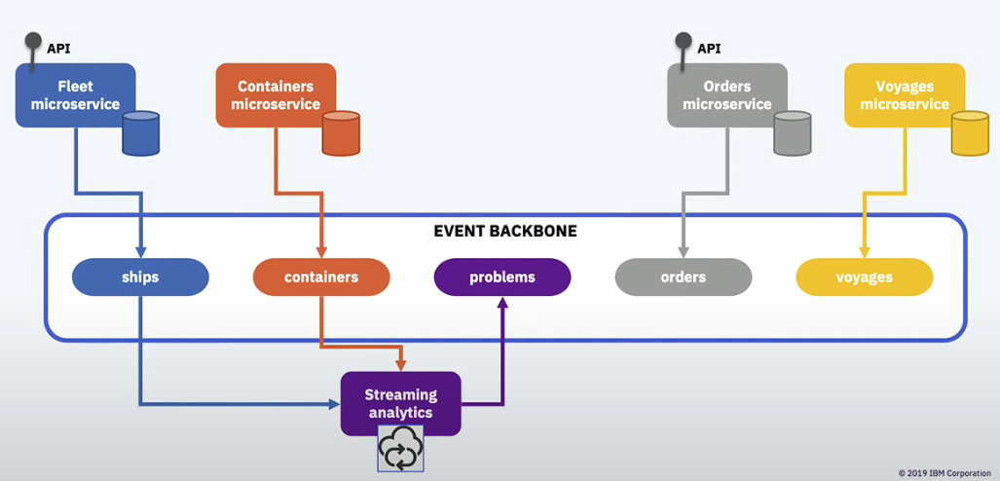

뱅킹 예제와 유사하게 잘못된 이벤트가 들어올 시 `streaming analytics`로 이상을 감지하고 처리할 수 있다.

### 이벤트 기반 마이크로서비스를 위한 패턴

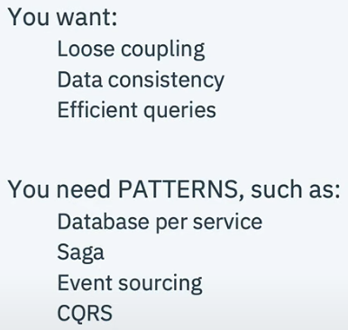

이벤트 publish/subscribe 패턴으로 서비스 간 결합도를 낮추고 서로 독립적으로 만들 수 있다. 그런데 이렇게함으로 두가지 문제가 발생한다.
한가지는 데이터 일관성이다. 모놀리틱에서는 트랜잭션으로 데이터 정합을 쉽게 맞출 수 있다. 그런데 서비스가 쪼개지면서 모놀리틱처럼 정합을 맞추기 어려워진다.
물론 2phase commits 를 하면 좋겠지만 이는 스케일 하지 않다. 대안이 필요하다.
그리고 이벤트 기반 방식으로 가면 필요한 데이터가 있는 경우 어떻게 데이터를 얻을 수 있을까? 이벤트를 뒤질수도 없다. 이것도 대안이 필요하다.

### 패턴 - Database per service

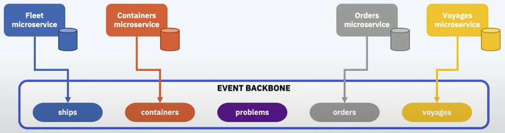

각 마이크로서비스마다 데이터베이스를 가지도록 한다. 여러 마이크로서비스가 하나의 중앙 데이터베이스를 사용하도록 구현하기도 한다.
이는 서비스 별로 결합을 만든다. 데이터베이스 스키마 변경에 모든 서비스 변경이 필요해진다. 이를 피하기 위해 마이크로서비스는 각 데이터베이스를 가진다.
서비스마다 필요한 데이터는 각자 정의해서 replication 을 가진다. 이렇게 데이터베이스를 쪼개면 어떻게 데이터 일관성을 맞출까? Saga 패턴으로 해결할 수 있다.

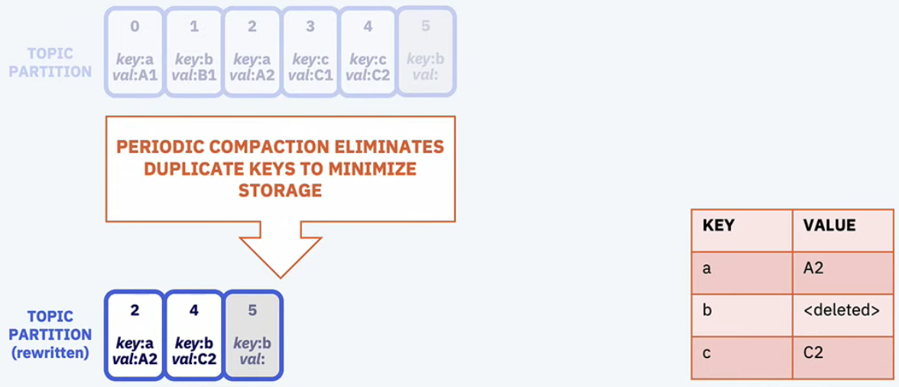

카프카는 data replication 에 대해서 장점을 가진다. 어차피 필요한 것은 가장 최신 데이터이다. 카프카 log compaction 으로 가능하다.

### 패턴 - Sagas

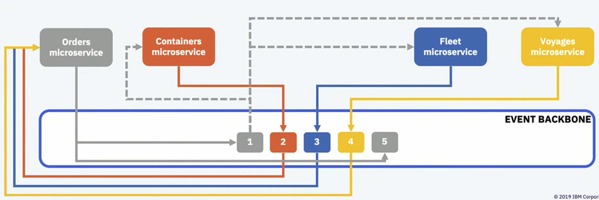

분산 트랜잭션없이 마이크로서비스간 데이터 일관성을 유지하는 방법이다. 여러 트랜잭션을 chaining 하는데 실패할 경우 보상하는 형태로 데이터 일관성을 지키는 패턴이다.
프로그래밍으로 풀면 좀 복잡해질 수 있다. 구현 방식에는 orchestration 와 choreography 이 있다. (개인적으로 [Applying the Saga Pattern • Caitie McCaffrey • GOTO 2015](https://www.youtube.com/watch?v=xDuwrtwYHu8) 영상이 Saga 패턴을 이해하는데 도움됐다.)

### 패턴 - Event sourcing

어떤 객체 상태 변경을 모두 이벤트로 발생시킨다. 이 이벤트들을 replay 하면 최종 객체 상태가 나온다.
유저부터 요청을 받으면 `Command Handler`가 이벤트를 이벤트 백본(backbone)으로 보내고 `Query Handler`가 쿼리가 좋게 처리한다.
이벤트 삽입까지가 atomicity 를 유지한다. audit log 목적이면 cold storage 에 영원히 이벤트를 저장할 수도 있다.

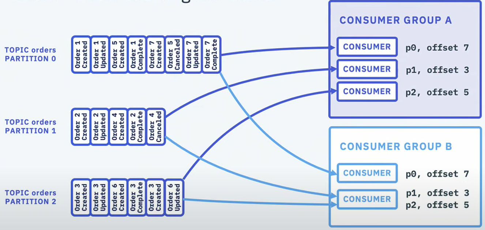

카프카로 `Event sourcing`을 구현하면 다음과 같다. 파티션 안에서 키별로 모인다. 그리고 파티션 수만큼 컨슈머가 있으면 1:1 매칭으로 처리할 수 있어진다.
컨슈머 수가 적다면 한 컨슈머가 더 많은 파티션을 구독하게 된다.

### 패턴 - CQRS

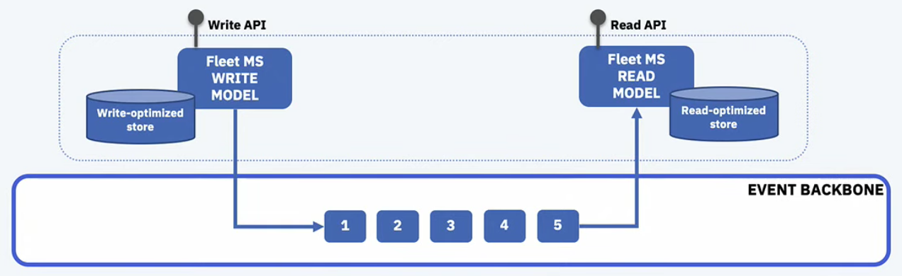

atomic write 와 efficient reads 가 동시에 일어나야한다. `write-optimized store`와 `read-optimized store`가 동시에 필요한 것인데 이는 하나의 구조로 구현할 수 없다.
write 와 read 를 쪼갤 필요가 있다. 다만 `write-optimized store`와 `read-optimized store` 간 데이터 일관성 맞추기가 어려운 문제로 남는다.

### 요약

이벤트 기반 마이크로서비스는 어플리케이션 간 결합을 낮추는데 효과적이다. 이벤트 스토밍과 같은 기법은 객체, 커맨드, 이벤트를 발견하는데 도움이 된다.
`Event sourcing`, `Saga` 같은 패턴은 이벤트 기반 마이크로서비스 복잡도를 감당할 수 있게 해준다.